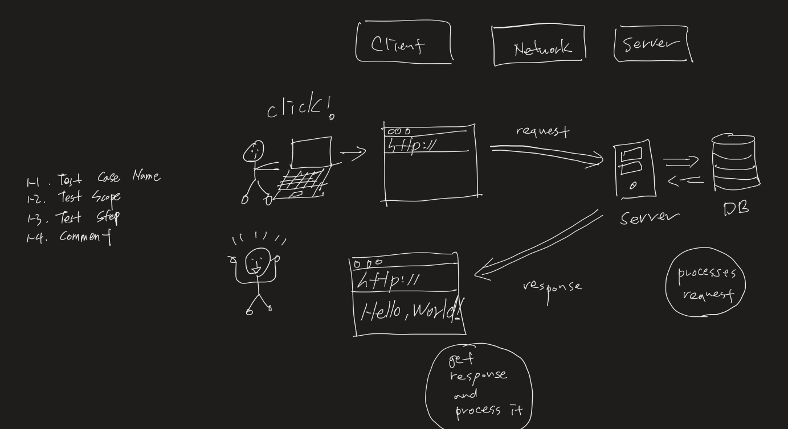

## 1. Add Two Numbers (no action, solved last time just placed here for reference)

<br/>
<hr/>
<br/>

## 2. Reverse string (no action, solved last time just placed here for reference)

<br/>
<hr/>
<br/>

## 3. 

3. Imagine a system that consists of a server and a client, which are connected over the network.   
The client sends a request, the server processes the request and sends back a response, 
and the client receives the response and processes it (e.g., check if the request was successful, process data that came from the server).  
Given this system, develop a test plan in terms of what to test, how to test, how to verify the system, etc.

[Client]-----[Network]-----[Server]

Format: 
1-1. Test Case Name
1-2. Test Scope
1-3. Test Steps 
1-4. Comments 



> Client

        A. Test Case name: Test Client Network Connection
        B. Test Scope: Client Side
        C. Test Steps:
            1. Open terminal on client
            2. Check network connection status between client and server
            3. `ping -c 4 jsonplaceholder.typicode.com`
        D. Comment: Verify ping test passes for the server


        A. Test Case name: Test all browser works same
        B. Test Scope: Client Side
        C. Test Steps:
            1. Open all browser
            2. Open development tool and move to Network tab
            3. Click the button which can send a request to server and check Network tab
        D. Comment: Verify browser send the request to server when user click the button


        A. Test Case name: Test an existing URI on server
        B. Test Scope: Client Side
        C. Test Steps:
            1. Open terminal on client
            2. Send GET request to URI
            3. `curl -i https://jsonplaceholder.typicode.com/todos/100`
        D. Comment: Verify the GET command returns 2xx status code


> Server

        A. Test Case name: Test Server response Incorrectly
        B. Test Scope: Server Side
        C. Test Steps:
            1. Add code on server side which occur err
            2. Open terminal on client
            3. Send POST request to server with proper data form
            4. `curl -I -d '{"title":"foo", "body":"bar", "userId":"1"}' -H 'Content-Type: application/json'   https://jsonplaceholder.typicode.com/posts`
        D. Comment: Verify that the server returns 5xx status code despite client send a request correctly


> Client - Server

        A. Test Case name: Test Client send a GET request correctly
        B. Test Scope: Client and Server Side (Integration)
        C. Test Steps:
            1. Open terminal on client
            2. Send GET request to server correctly
            3. `curl -i https://jsonplaceholder.typicode.com/todos/10`
        D. Comment: Verify the GET command received expected data from server


    	A. Test Case name: Test Client send a GET request Incorrectly
    	B. Test Scope: Client and Server Side (Integration)
        C. Test Steps:
            1. Open terminal on client
            2. Send GET request to server Incorrectly
            3. `curl -i https://jsonplaceholder.typicode.com/todos/1000`
        D. Comment: Verify that the server returns an error code (e.g. 4xx)


        A. Test Case name: Test Client send a POST request correctly
        B. Test Scope: Client and Server Side (Integration)
        C. Test Steps:
            1. Open terminal on client
            2. `curl -I -d '{"title":"foo", "body":"bar", "userId":"1"}' -H 'Content-Type: application/json'   https://jsonplaceholder.typicode.com/posts`
        D. Comment: Verify that the server returns what Client sent the data to server(expected data) with 201 status code


       


<br/>
<hr/>
<br/>

## 3a.

3a. Based on the test suite developed above, please come up with a regular testing template. 
For instance, this template is for a repeated testing practice which may include some test setup and teardown steps. 
It may also include some troubleshooting guidelines based on the test suite developed above. 
Hence, a tester will use this template for an ongoing testing efforts with the diagram mentioned in question 1. 

| Testing Template |  |
| ---| --- |
| Created By |  |
| Reviewd By |  |
| Priority |  |
| Title |  |
| Description |  |

| TCID | Test Step | Test Date | Expected Result | Actual Result | Execution Details (pass/fail/blocked/Onhold | Commnets |
| :--: | :--: | :--: | :--: | :--: | :--: | :--: |

<br/>
<hr/>
<br/>


## 4a. 

1.  open terminal
2.  npm i --save-dev
3.  npm test

```javascript
const expect = require('chai').expect
const addTwoNumbers = require ('./add-two-numbers')
const LinkedList = require ('./lib/linkedList')
const helper = require ('./lib/helper')


describe("AddTwoNumbers - it should be passed", function () {
    let linkedList1, linkedList2

    beforeEach(function() {
        linkedList1 = new LinkedList();
        linkedList2 = new LinkedList();
    });

    it("#1 [0], [0] => [0]", function () {
        linkedList1.add(0)
        linkedList2.add(0)
        expect(helper(addTwoNumbers(linkedList1, linkedList2))).to.equal(0);
    });

    it("#2 [9,9,9], [9,9] => [8,9,0,1]", function () {
        linkedList1.add(9)
        linkedList1.add(9)
        linkedList1.add(9)
        linkedList2.add(9)
        linkedList2.add(9)
        expect(helper(addTwoNumbers(linkedList1, linkedList2))).to.equal(1098);
    });

    it("#3 [2,4,3], [0] => [2,4,3]", function () {
        linkedList1.add(2)
        linkedList1.add(4)
        linkedList1.add(3)
        linkedList2.add(0)
        expect(helper(addTwoNumbers(linkedList1, linkedList2))).to.equal(342);
    });

    it("#4 [2,4,3], [5] => [7,4,3]", function () {
        linkedList1.add(2)
        linkedList1.add(4)
        linkedList1.add(3)
        linkedList2.add(5)
        expect(helper(addTwoNumbers(linkedList1, linkedList2))).to.equal(347);
    });

    it("#5 [2,4,3], [8,5] => [0,0,4]", function () {
        linkedList1.add(2)
        linkedList1.add(4)
        linkedList1.add(3)
        linkedList2.add(8)
        linkedList2.add(5)
        expect(helper(addTwoNumbers(linkedList1, linkedList2))).to.equal(400);
    });

    it("#6 [2,4,3], [8] => [0,5,3]", function () {
        linkedList1.add(2)
        linkedList1.add(4)
        linkedList1.add(3)
        linkedList2.add(8)
        expect(helper(addTwoNumbers(linkedList1, linkedList2))).to.equal(350);
    });

    it("#7 [2,4], [8,5] => [0,0,1]", function () {
        linkedList1.add(2)
        linkedList1.add(4)
        linkedList2.add(8)
        linkedList2.add(5)
        expect(helper(addTwoNumbers(linkedList1, linkedList2))).to.equal(100);
    });

    it("#8 [-1], [-1] => [0] - two non-negative integers", function () {
        linkedList1.add(-1)
        linkedList2.add(-1)
        expect(helper(addTwoNumbers(linkedList1, linkedList2))).to.equal(0);
    });
});


describe("AddTwoNumbers - it should be failed", function () {
    let linkedList1, linkedList2

    beforeEach(function() {
        linkedList1 = new LinkedList();
        linkedList2 = new LinkedList();
    });


    it("#1 [-1], [-1] => [-2] - representing two non-negative integers", function () {
        linkedList1.add(-1)
        linkedList2.add(-1)
        expect(helper(addTwoNumbers(linkedList1, linkedList2))).to.equal(-2);
    });

    it("#2 [9,9,9], [9,9] => [8,9,0,1] - The digits are stored in reverse order", function () {
        linkedList1.add(9)
        linkedList1.add(9)
        linkedList1.add(9)
        linkedList2.add(9)
        linkedList2.add(9)
        expect(helper(addTwoNumbers(linkedList1, linkedList2))).to.equal(8901);
    });

    it("#3 [], [] => [] - given two non-empty linked lists", function () {
        expect(helper(addTwoNumbers(linkedList1, linkedList2))).to.equal(0);
    });
});

```

<br/>
<hr/>
<br/>

## 4b. 

1.  open terminal
2.   python ./reverse-string/test.py 

```python
import unittest
from reverse_string import Solution

class Test(unittest.TestCase):

    """pass case"""
    def test_1(self):
        self.assertEqual(Solution.reverseParentheses(self, "ta()usw((((a))))"), 'tauswa')

    def test_2(self):
        self.assertEqual(Solution.reverseParentheses(self, "(abcd)"), 'dcba')

    def test_3(self):
        self.assertEqual(Solution.reverseParentheses(self, "(u(love)i)"), "iloveu")

    def test_4(self):
        self.assertEqual(Solution.reverseParentheses(self, "(ed(et(oc))el)"), 'leetcode')

    def test_5(self):
        self.assertEqual(Solution.reverseParentheses(self, "a(bcdefghijkl(mno)p)q"), 'apmnolkjihgfedcbq')

    def test_6(self):
        self.assertNotEqual(Solution.reverseParentheses(self, "(u(love)i)"), 'ievolu')

    def test_7(self):
        self.assertNotEqual(Solution.reverseParentheses(self, "(ed(et(oc))el)"), 'edetocel')

    """fail case"""
    """square bracket"""
    def test_8(self):
        self.assertEqual(Solution.reverseParentheses(self, "(u[love]i)"), 'iloveu')
    """not pair of matching parentheses"""
    def test_9(self):
        self.assertEqual(Solution.reverseParentheses(self, "(ed(et((oc))el)"), 'leetcode')


if __name__ == "__main__":
    unittest.main()

```

<br/>
<hr/>
<br/>

## 5. 

<br/>
<hr/>
<br/>

## 6. 

    Chrome DevTools, Istanbul by jest for code coverage, MOCHA, JEST, PUPPETEER

<br/>
<hr/>
<br/>

## 7. 

    JavaScript

<br/>
<hr/>
<br/>


## 8. 

1.  Requirement Analysis
   
        The test team studies and analyzes the requirements from a testing perspective
        This Phase helps to identify whether the requirements are testable or not. If any requirement is not testable, the test team can communicate with various stakeholders(Client, Business Analyst, Tech Leads, System architects, etc) during this phase so that the mitigation strategy can be planned

        Deliverables: List of all testable requirements, Automation feasibility report (if applicable)


2.  Test Planning

        Test planning is the first step in the testing process.
        In this phase typically Test Manager/Test Lead involves determining the effort and cost estimates for the entire project. Preparation of the Test Plan will be done based on the requirement analysis.
        Activities like resource planning, determining roles and responsibilities, tool selection (if automation), training requirements, etc., carried out in this phase.

        Deliverables: Test Strategy document, Test Plan, and Test Effort estimation document.


3.  Test Design(Test case development)

        The test team starts with test case development activity here in this phase. Testers prepares test cases, test scripts (if automation), and test data.
        Once the test cases are ready then these test cases are reviewed by peer members or team lead.
        Also, the test team prepares the Requirement Traceability Matrix (RTM). RTM traces the requirements to the test cases that are needed to verify whether the requirements are fulfilled.

        Deliverables: Test cases, Test Scripts (if automation), Test data.


4.  Test Environment Setup

        This phase can be started in parallel with the Test design phase.
        The test environment setup is done based on the hardware and software requirement list. In some cases, the test team may not be involved in this phase. The development team or customer provides the test environment.
        Meanwhile, the test team should prepare the smoke test cases to check the readiness of the given test environment.

        Deliverables: Test Environment. Smoke Test Results.

    - What is Smoke Testing in Software Testing?

        Smoke Testing is done to make sure if the build we received from the development team is testable or not. It is also called as “Day 0” check. It is done at the “build level”.
        It helps not to waste the testing time to simply testing the whole application when the key features don’t work or the key bugs have not been fixed yet. Here our focus will be on primary and core application workflow.


5.  Test Execution

        The test team starts executing the test cases based on the planned test cases. If a test case result is Pass/Fail then the same should be updated in the test cases.
        The defect report should be prepared for failed test cases and should be reported to the Development Team through a bug tracking tool for fixing the defects.
        Retesting will be performed once the defect was fixed.

        Deliverables: Test case execution report, Defect report, RTM


6.  Test Closure

        The final stage where we prepare Test Closure Report, Test Metrics.
        The testing team will be called out for a meeting to evaluate cycle completion criteria based on Test coverage, Quality, Time, Cost, Software, Business objectives.
        The test team analyses the test artifacts (such as Test cases, Defect reports, etc.,) to identify strategies that have to be implemented in the future, which will help to remove process bottlenecks in the upcoming projects.
        Test metrics and Test closure report will be prepared based on the above criteria.

        Deliverables: Test Closure report, Test metrics

<br/>
<hr/>
<br/>

## 8a. 

1.  Requirement Analysis - BRS(Business Requirement Specification) documents
2.  Test Planning - Requirements Documents
3.  Test Design(Test case development) - Requirements Documents (Updated version of unclear or missing requirement)
4.  Test Environment Setup - Test Plan, Test environment setup plan, Smoke Test cases, Test Data
5.  Test Execution - Test Plan document, Test cases, Test data, Test Environment
6.  Test Closure - Test Case Execution report (make sure there are no high severity defects opened), Defect report

<br/>
<hr/>
<br/>

| STLC Phase | Documentation	| Deliverables |
| :----------: | :-------------- | :------------ | 
| Requirement Analysis | Business Requirements specification document<br/> Acceptance criteria document<br/> Application architectural document | List of all testable requirements<br/> Automation feasibility report (if applicable) |
| Test Planning | Requirements Documents<br/> Automation feasbility report | Test Strategy document<br/> Test Plan<br/> and Test Effort estimation document |
| Test Design<br/>(Test case development)	| Requirements Documents (Updated version of unclear or missing requirement)<br/> RTM(Requirement Traceability Matrix)<br/> Test Plan<br/> Test Estimation Document<br/> Automation Analysis Report | Test cases<br/> Test Scripts (if automation)<br/> Test data |
| Test Environment Setup | Test Plan<br/> Test environment setup plan<br/> Smoke Test cases<br/> Test Data | Test Environment<br/> Smoke Test Results |
| Test Execution | Test Plan document<br/> Test cases<br/> Test Scripts<br/> Test data<br/> Test Environment | Test case execution report<br/> Defect reports<br/> RTM(Requirement Traceability Matrix) |
| Test Closure | Testing has been completed<br/> Test Case Execution report (make sure there are no high severity defects opened)	| Test Closure report<br/> Test metrics |


